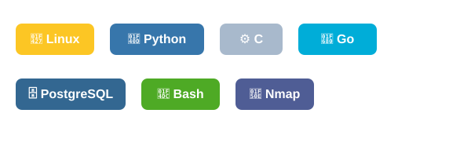

---

  

  <h1>⚡ gt-ayush — The Chaos Learner</h1>
  <b>Systems‑First Developer • Chaos Learner • Limit Breaker</b>

  
<i>Date: 2026-07-12</i>

---

## Abstract

This document is a concise professional report describing background, technical skills, tooling, and contact information for Ayush (aka gt-ayush). It is arranged into numbered sections for clarity and quick reference.

---

## Table of Contents

- [1 Introduction](#1-introduction)
- [1.1 Technical Focus](#11-technical-focus)
- [2 Full Technical Skill Tree](#2-full-technical-skill-tree)
- [3 Tech Stack Showcase](#3-tech-stack-showcase)
- [4 Contact & Collaboration](#4-contact--collaboration)
- [5 Thought for the Day](#5-thought-for-the-day)

---

## 1. Introduction

I’ve always been the kind of person who would rather spend **three hours understanding how something works** than thirty seconds just using it. My journey started with chaos — bricking my first OS in 4th grade while tinkering with BIOS settings and Rufus. That fearless curiosity moved from the bedroom floor to the Linux terminal.

I call myself a **Chaos Learner** because I thrive when things move fast and the stakes are high. Whether it’s teaching myself **C in 12 hours** for a project or architecting a billing system with unconventional database logic, I build working solutions under pressure.

### 1.1 Technical Focus
- **Systems & Infrastructure:** Linux (Arch/Manjaro/Debian/Android), Shell scripting, DNS (PowerDNS, BIND)
- **Development:** Python, C, C++, Javascript, Java, Go — backend stability and clear logic
- **Security:** Firewalls, threat research, Post‑Quantum Cryptography (PQC)

I believe **great code is useless without great documentation**. I’m bridging hands‑on tinkering with theoretical architecture while working toward DevOps and Cybersecurity roles.

---

## 2. Full Technical Skill Tree

| **[Programming](ca://s?q=Tell_me_more_about_programming_skills)** | **[Networking & Security](ca://s?q=Tell_me_more_about_networking_and_security_skills)** | **[Systems & Infrastructure](ca://s?q=Tell_me_more_about_systems_and_infrastructure_skills)** |
|-------------------------------|----------------------------------|----------------------------------|
| • **C** (Logic & Performance) • **Python** (Automation & Data) • **Go** (Concurrency) • **Java** (OOP) • **JavaScript** (Frontend) • **HTML5 & CSS3** • **Bash/Zsh** (Scripting) | • **DNS Management** (PowerDNS, BIND) • **Firewall Config** (TCP/UDP) • **TLS/SSL Handshakes** • **Nmap & SSLScan** • **Post‑Quantum Cryptography Research** | • **Linux Admin** (Arch, Debian, Android) • **BIOS/UEFI Config** • **OS Installation** (ISO/Rufus/Boot) • **SQL Databases** (PostgreSQL, MySQL) • **Legacy Logic** (Excel as DB) |

---

## 3. Tech Stack Showcase

The diagram below highlights the tools and libraries I commonly use across my projects:

  

---

## 4. Contact & Collaboration

Ready to build resilient systems, solve security challenges, or level up Linux workflows. Connect via LinkedIn, email, or GitHub.

  
  
  

---

## 5. Thought for the Day

<!-- THOUGHT_FOR_THE_DAY_START -->
**Sunday**
> Rest is not laziness; it is preparation for the next beginning.
<!-- THOUGHT_FOR_THE_DAY_END -->

  <i>"Logic is the beginning of wisdom, not the end."</i>

